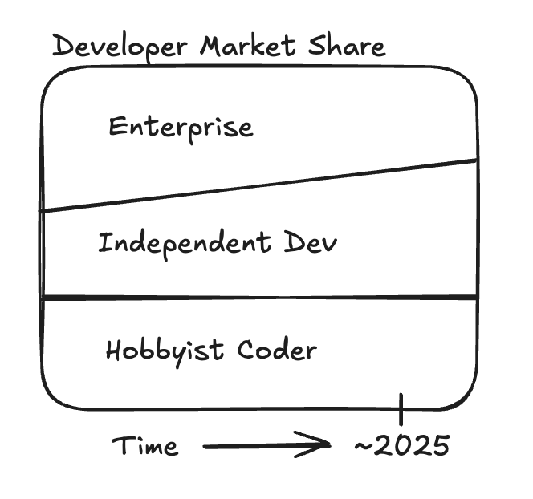
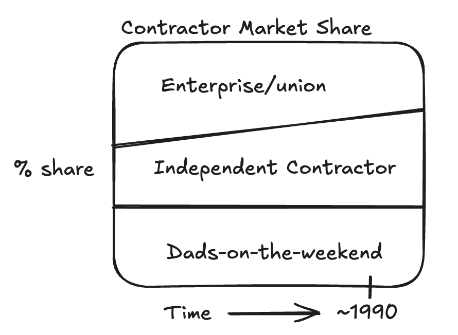

# DeWalt and AI

I think AI is causing the software world to rip itself apart. I've heard tell of software companies resourcing "elite teams", paying for 3rd party "elite teams", adding additional interview screens to identify the "elite AI-enabled engineer". My two cents is that everyone in software is excited by AI but have no idea what they're looking for or how to get it. But for sure a lot of people are getting fired.

This is causing a shift in the market for software developers. I posit that there are three different categories of developers, right now: 1. Developers who work at a company 2. Developers who work for themself 3. Hobbyists who are messing around. I also guess that the share of these developers looks something like this, considering all of the firings and quittings, etc.

  
  

This sort of market harks back to a case we studied at business school, about DeWalt power tools. I'll keep the summary super high level to avoid spilling all of Yale's IP on my blog.

Basically, back in 1990, the undisputed champ of power tools was Black+Decker. They had the best power tools, for the cheapest. Enterprise contractors would buy them for their employees. Hobbyists would buy them. But there was a new segment of the contractor market that was growing like crazy, who wouldn't touch Black+Decker tools: independent contractors. It was confusing, why wouldn't they buy the tools if they were the best and cheapest?

It turned out that if independent contractors bought Black+Decker and they showed up to do a job at the house of a hobbyist, the hobbyist would see the contractor pull out a Black+Decker drill and say, "hey, wait a minute, *I* have those tool. *I* could do that job. Why am I paying this person?" It mattered not that the hobbyist could not, in fact, do that job. It only mattered that they thought they could.

The genius of DeWalt is that Black+Decker figured out that independent contractors needed tools that lent credibility to them as a professional. DeWalt became the tool *for professionals*. They branded bright yellow, so everyone in the neighborhood could see that the contractor carrying DeWalt tools was a *professional*, not a hobbyist. They also did some things around servicing like quick tool replacement that contractors liked (they couldn't buy a huge pool of tools like enterprise builders and when one broke they needed it fixed pretty quickly). It was important to Black+Decker (and DeWalt) to cater to these people because independent builders were growing in number around 1990 due to anti-union Reagan policies and the commericial real estate crash.

  
  

Let's go back to take a look at the software industry.

Who's the power tool champion? DeWalt. DeWalt leads U.S. market share at 25%, nearly double second-place Milwaukee (13%) and Makita (12%). In 5th place is Black+Decker at 8% [1]

What if I told you that Black+Decker *owns* DeWalt. Whaaaa?? Why do they own a brand that they compete with? [2]

It turns out, they don't exactly *compete* with Black+Decker. 

How did they become the champ? It turns out that DeWalt is actually a brand created by Black+Decker, who had the best

In the early 1990s Black+Decker revitalized a brand they had in their portfolio called DeWalt to cater to a specific and growing segment of the power tools market: professional tradespeople. Back then, the power tools market was segmented into three parts, enterprise construction, where large employers bought power tools for their employees to use, hobbyist, and a third, newer, and growing segment, independent contractors. Independent contractors were like enterprise in that they use their power tools to make a living, but like hobbyists in that they selected the tools that they use, not some corporate decision maker. Independents were also the fastest-growing segment.

  
  
Contractor Market Share

There are

Black+Decker was confused why they weren't selling to independents. They had the best tools and they were cheaper than their competition, Milwaukee and Makita, they had better service, better brand, better everything. So why weren't the independent contractors choosing Black+Decker?

The problem was the dads-on-the-weekend. A dad-on-the-weekend would hire an independent contractor to do a job, build a shed, fix the heater, what have you, the contractor would show up with Black+Decker tools, and the dad-on-the-weekend would say "hey, wait a minute, *I* have those tools. I might be a corporate manager during the day, but during the night *I* am a *builder*". And the dad-on-the-weekend would decide to do the job themself. Note that there is probably a huge difference between what a dad-on-the-weekend can do with the same set of tools as a professional, but that mattered not, what mattered was the *perception* of the dad-on-the-weekend that they could do the job. (note: difference between building and building + maintaining)

Enter DeWalt. DeWalt was flashy. Bright yellow. Marketed as *the* brand for independent contractors. For professionals. Under the hood, the technology was not all that different from Black+Decker. But the look and servicing of the DeWalt tools were different. Independent contractors couldn't buy a huge pool of power tools like enterprise, so when a tool broke, they needed a new one fast. So DeWalt set up a stand in Home Depots to do just that. DeWalt was a runaway success with the professional market, not chiefly due to the product itself, but by the way the brand supported independent contractors, both in tool replacement, and in credibility in the eyes of their clients.

Fast forward 30 years. Today, we have a number of brand new tools that build software, reshaping the tech industry, and will probably cause the number of independent contractor software engineers to grow. We have a number of hobbyist "dad-on-the-weekend" programmers looking at these tools thinking "hey, I can do what a pro does". 

[1] https://openbrand.com/newsroom/blog/power-tools-market-trends-infographic#:~:text=DEWALT%20%E2%80%93%2025%25,Dremel%20%E2%80%93%205%25 

[2] https://www.stanleyblackanddecker.com/brands
