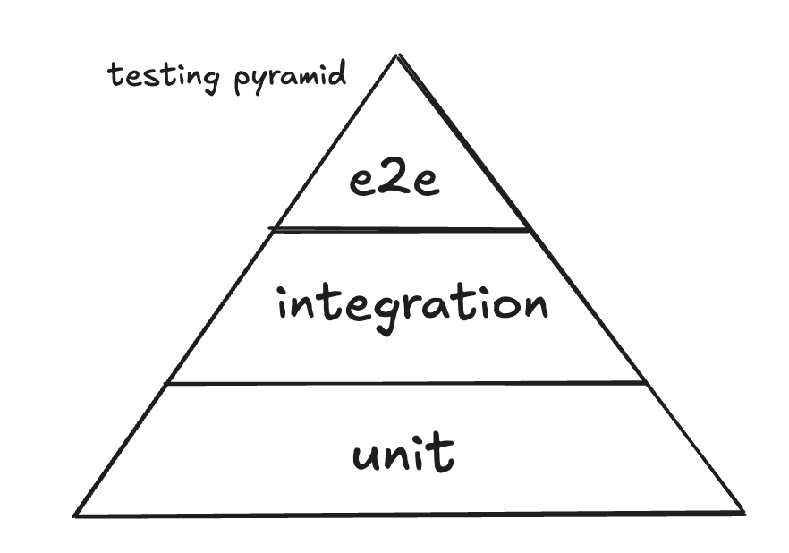

# How to test a data pipeline

If you work on a data pipeline, and you think it might be broken but are not quite sure, fear not! You are not alone. Many people have problems testing pipelines, enough so that several companies asked me some variant of "how to test a data pipeline" as an interview question. With the advent of RAG, data pipelines are far from dead. With the advent of vibe coding, it's more important than ever to verify not just that the pipeline runs, but also that the logic is correct. It's easier to test behavior on for example a long-lived stateless service, because usually less data comes in with the request, the response comes quickly, and less data comes out. It's harder to test a pipeline that takes in a ton of data, takes hours to run, and outputs a whole bunch of data. How do we know that what comes out is what's expected?

  
  
Testing pyramid

## Unit tests

Break the pipeline into stages and test each stage independently, then test them together

## Integration tests
