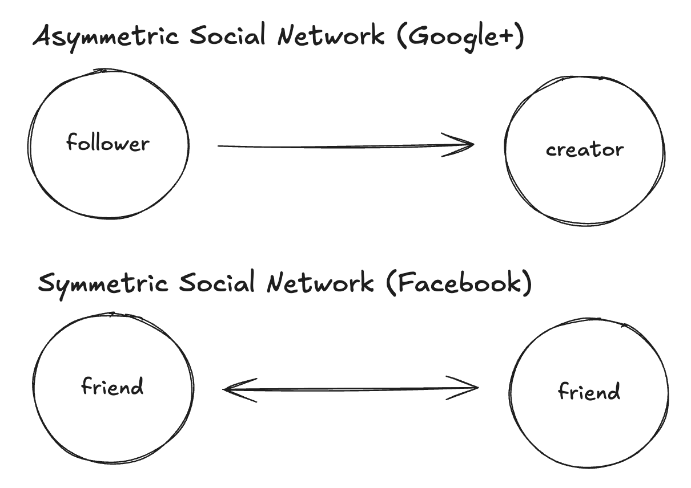

# Sunsetting Google+

  
  
The Google+ sunset, courtesy Nano Banana

I was at my first day of orientation at Google all excited to join the Google+ team when I got a text from my dad: "have you seen this?" he said, and then he attached a link to a news article, "Google Shutting Down Google+". I texted back, "No". So began my year helping to shut down Google+.

There ended up being some interesting problems to solve during this year. Shutting off as engrained a system as Google+ was not just a matter of hitting the power switch. Required was communication with client owners, working with them to plan ahead for the turndown, so that 500s from Google+ did not break their product. And it required creating a plan ourselves, for example which API should return which code at which time, and sticking to this plan to give a predictable schedule of changes. 

In addition, there were cultural aspects of this experience that looking back were unique. It's been the only time in my career where the main focus of the team was not on the sunrise of something new, but rather the sunset of what was. 

## Google Plus and Creators

Creators loved Google Plus. These could be photographers, poets, potters, painters, anyone who's creation could be shared over the web. Google+ was an [asymmetric](https://www.seobythesea.com/2011/08/googles-asymmetric-social-network-and-plus-authoring-patent) social network, which meant that one could just follow people without them having to accept a friend request. While this pattern is common today (twitter, facebook pages, etc), it wasn't at the time, and creators found their following could grow much quicker, broader, and more diverse on Google Plus than with Facebook's symmetric model.

  
  
Asymmetric vs Symmetric Social Network

This goodbye was emotional for people who had used Google+ to build a following and potentially find some sort of meaning and/or connection in their life. I went to a community-run goodbye event like ones alluded to [here](https://www.wired.com/story/google-plus-goodbye) and there were tears. Frankly, I decided to work on this product because it was my way into Google, and I didn't know the emotional significance it had to people until I joined the team.

## The Google Plus Team

Also affected were my teammates, some of whom had been with Google+ for a decade. Some made significant career bets on the product. Long before I joined, Google+ drew the ire of the internet for how aggressively it [pursued signups](https://arstechnica.com/gadgets/2012/01/google-doubles-plus-membership-with-brute-force-signup-process) on other Google products like Youtube and Gmail. And the Google+ fans were not exactly thrilled we were turning it down. It could feel at times that we were working on a project that nobody wanted. And I think that's what helped us come together as team. We were the support that we had. 

This team was what I consider to be my experience of the "old Google". It was not uncommon over my time at the company for longtime Googlers to talk about what it used to be like, that holiday party, the trip to Hawaii, et cetera, et cetera. This experience was usually my contribution to this topic: seeing our director gather the team around for an impromptu all hands, playing board games with the other engineers after work, dogs running around the office halls. 

## Google took care of the team

Google was very lenient on the team in terms of giving us time to find a new role. By the time the project concluded, I was ready to go, ready to go build something and prove to myself I was that Google engineer I had hoped to be. I was suprised that not everyone felt like this. But I was young and ambitious and I thought that everyone thought how I thought. I just felt like I had to go prove myself, so I found a team in Cloud, the Serverless team, and that started a whole new adventure.