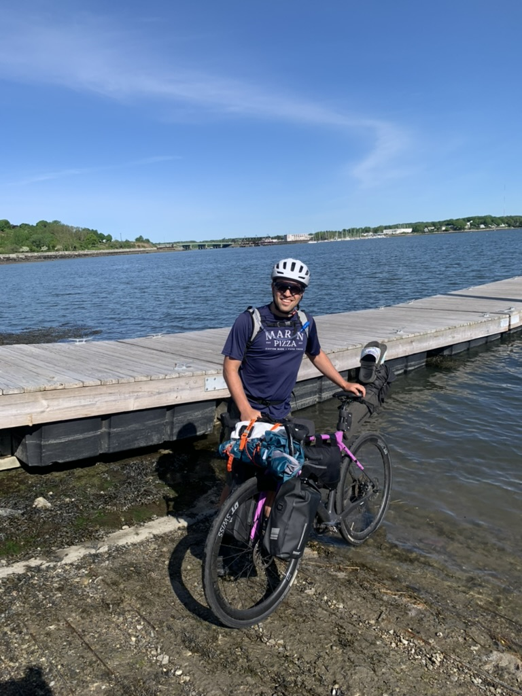
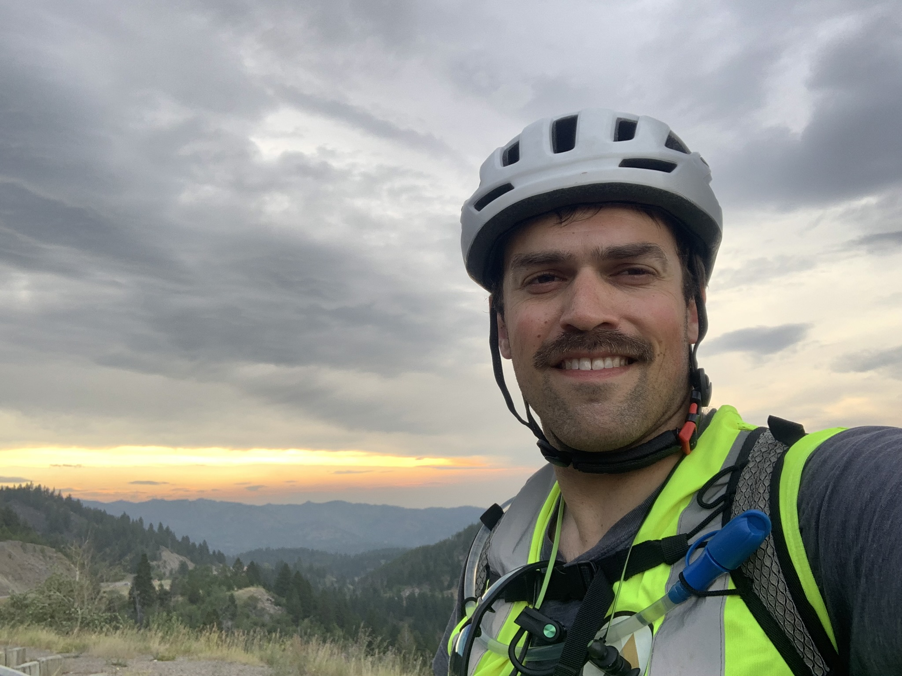
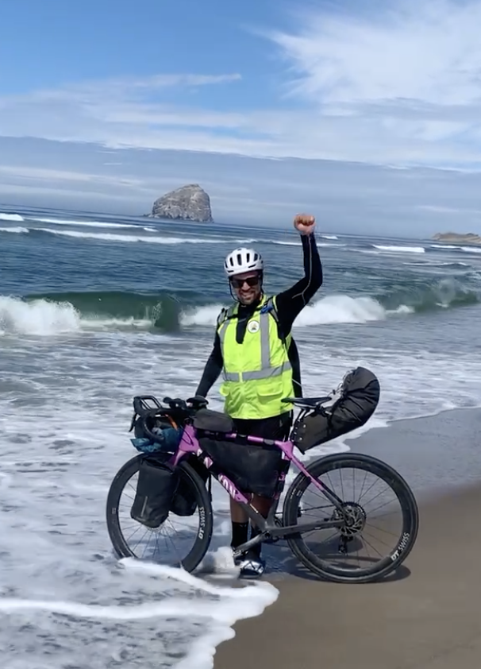

# What bicycling across the United States taught me about software engineering

*November 11, 2025*

The summer between my first and second year of grad school, I rode my bicycle solo across America, from Portland, Maine to Pacific City, Oregon. Having just turned 30, I felt that for a journey like this, it was either now or never. I learned a lot over the course of this trip, about myself and the world around me, and I feel that some of it is applicable to software engineering. This post shares some of this learning.

  

    
    
Portland, Maine - The starting point

  

  

    
    
At the top of the Continental Divide

  

  

    
    
Pacific City, Oregon - The finish

  

## The importance of making a little progress every day

This giant bike ride across the United States was just 74 days of a little bit at a time.

Many large and ambitious projects are like this. One day at a time of just getting a little bit better, a little bit closer to the goal. Maybe some days are large jumps, and some days are small. But every day, a little closer.

In the world of software, it is not always the case that you can see progress on a map. In some cases, it is up to you to create the map. And the way that progress on the map is marked can be not so obvious either. Especially when software systems aren't really visible, while the inputs and outputs to these systems may be, I find that talking about these systems can be like talking about a shared visualization.

Some days I would pull up the map, maybe in Michigan, or in Montana and I'd say to myself, "Wow, I can't believe I biked all that." And I'd recognize how far I'd come. It turned out that aside from my parents and close friends, no one was really following the trip. I wasn't a celeb. And most people I passed on the road had no idea I had started several thousand miles to the east.

The thing about working at Google is that everyone you work with, they work at Google too. While I may have been "Dan who works at Google" to some outside of work, while I was at work, I was just "Dan". And it was up to me to make a name for myself on my own merits. Up to me to be in charge of my own journey, like while I was biking.

Actually, Google **does** provide a map to its employees to follow. It's called the promotion ladder. Criteria that each employee must fulfill in order to get to the next level in the organization. And this map, it was followed far more closely than I would have expected before I joined the company.

But while this map provides general guidance that is measured over six month checkpoints, it was really up to me to create the map that I followed every day. What projects did I want to work on? What bets did I want to make? And while the questions were different in nature than being on the bike (Where can I camp? How much food should I carry?), the ethos is the same: questions that help me learn a little more about myself and the world around me.

<!-- ## The importance of asking for help

By nature, I am an independent person. I think part of me enjoys the challenge of confronting a problem, so much so that I do not want to avoid the challenge by raising my hand. But sometimes, asking for help is the right thing to do.

There were times on this bicycling journey that I had no choice but to ask for help. I stayed in the homes of a few friends, and many kind strangers that I found through [Warmshowers](https://warmshowers.org). Folks at campsites invited me over to have a hot coffee or a cold beer. The owner of a hotel gave me a personal tour of her small town, Medina, North Dakota, population about a hundred.

In the world of software engineering, nothing ever gets done alone. At Google, teams of people would build the software, separate teams  -->