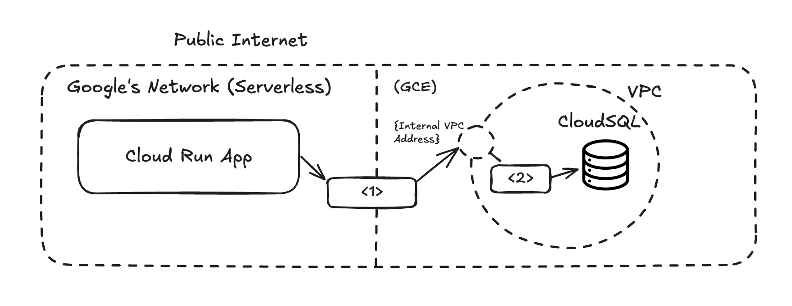
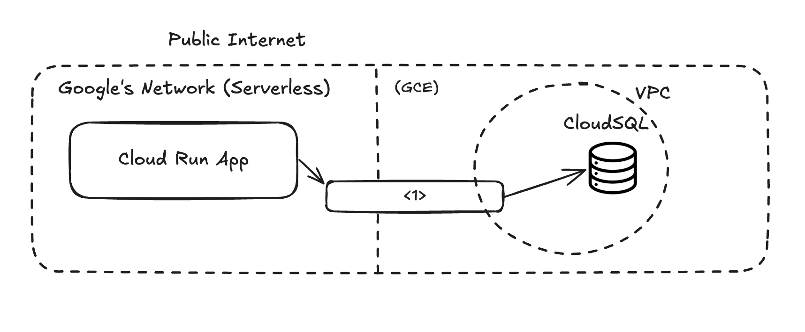

# Why Serverless VPC Access exists

When I joined the GCP Serverless engineering team in October of 2019, I was assigned to a relatively small part of the system called "Serverless VPC Access" (or sometimes, Serverless VPC Access *Connectors*). For some fleeting time I had no idea what this component did or what purpose it served. Because this team turned over frequently, I found it hard to find someone with the full context. Over time, I pieced together bits of this story until I had something that made sense to me. This is that story.

## Before Serverless VPC Access Connectors

Serverless VPC Access Connectors allow you to call a public Cloud Run service and have that service connect to private data, while keeping all packets within Google's network. Prior to VPC Access, you had a Cloud Run service, you had a CloudSQL or similar database in the VPC, and in order to get the Cloud Run Service to access the database, you had to expose the database publicly and then tell Cloud Run to access it like any other public endpoint.

  
  
Prior to VPC Access

Of course, Google added some special protections for this kind of connection, e.g. [Authorized Networks](https://docs.cloud.google.com/sql/docs/mysql/authorize-networks), but in general companies probably didn't like exposing their database to the public internet, because this new attack vector could violate policy around security posture, either internal or external (e.g. HIPAA/PCI).

So this part of the system, while relatively small, was hugely important to the Serverless organization, because it supported workloads specifically for the largest customers who had the most sensitive data.

## VPC Access Part I

VPC Access is really a chain of components internal to Google that forwards packets from Cloud Run App to a VPC through a path that is all Google-owned. The system provisions managed networking resources on behalf of the customer, abstracting away the underlying details.

  
  
VPC Access

Note that the infrastructure in the VPC ("<2>") is a NAT that makes it look like the traffic originates in the VPC from the Database's perspective. This solves the problem of exposing the database publicly, and opsec teams can write security rules that just include the IP range that is reserved for the connector.

One quirk of this setup is that the customer provisions a "connector", where a "connector" is really a set of resources that includes a managed instance group running a NAT in the VPC. This infrastructure is abstracted in ways that can make debugging more difficult for customers, who couldn't access the underlying compute, even if they wanted to. I felt this design choice increased the support load on the team and contributed to the frequent team turnover. But to be fair, exposing the infrastructure could have had all sorts of burdens as well. I guess that bridging an internal networking gap in this way left only options that were not ideal.

## The next generation connector

Another part of the organization recently released Direct VPC Egress, which I believe uses some new GCE Networking functionality to obviate the need for the Connector (but not the need for the Private IP addresses). I wasn't involved in that effort so I don't know the new architecture. But if I had to guess, I think it would look something like this:

  
  
Post VPC Access Connectors

A couple reddit posts say it works pretty well. Good job team!

## Conclusion

VPC Access was important enough to the Serverless organization to staff two teams on it: One team managing the legacy path, and one team creating the latest direct VPC egress. 

One reason for this high level of investment could be that Google Cloud doesn't make the big money on Cloud Run, they make the big money on what Cloud Run *connects to*. Compute is just a thinner margin business than storage. A rough [public estimate](https://blog.vonng.com/en/cloud/profit) says margins of 15% for compute and 50% for storage. To illustrate this, there are several different flavors of compute that Google offers including Cloud Run, GKE, Kubernetes, and it was not uncommon to see one customer ramp up spend on Cloud Run until they put together a small ops team to manage a GKE setup. Then there's different cloud providers which become even easier to switch to if your database is already publicly exposed. VPC Access is about keeping customers within Google's ecosystem by offering an easy path between their persisted data and a managed compute service, encouraging Google Compute with Google Storage, the latter of which can be particularly lucrative.
